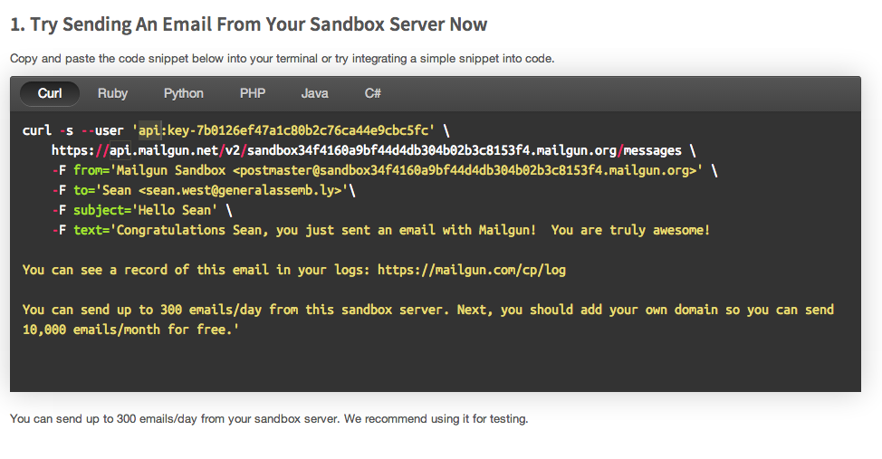

##Using Mailgun instead of Sendgrid

If you are having trouble with Sendgrid you can use Mailgun instead.

Sign up for the api here: http://www.mailgun.com .

When you are done creating an account you will come to a page with this image:


Copy and paste the following code into a text editor and substitute in the values (e.g. API keys and urls) from the Mailgun page that you see.

```ruby
require 'httparty'

params = {
	from: "Mailgun Sandbox <postmaster@sandbox34f4160a9bf44d4db304b02b3c8153f4.mailgun.org>", 
	to: "Sean <sean.west@generalassemb.ly>", 
	subject: "Hello Sean", 
	text: "Congratulations Sean"
}

url = "https://api.mailgun.net/v2/sandbox34f4160a9bf44d4db304b02b3c8153f4.mailgun.org/messages"
auth = {:username=>"api", :password=>"key-7b0126ef47a1c80b2c76ca44e9cbc5fc"}

HTTParty.post(url, {body: params, basic_auth: auth})
```

Throw this code into pry and if it works than you have a way to send email!!
