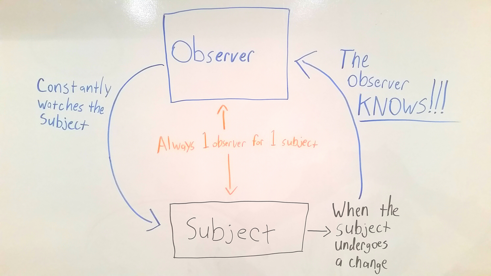

#Intro to Backbone.js

---


##The importance of AJAX and not having to refresh our page
***Question***: What is the advantage of using AJAX over traditional HTTP requests?

***Answer***: AJAX allows us to communicate with our server without refreshing the page.

**This is really important!**

Cast your mind back to the good old days when we were writing TCP Servers in Ruby. Every time we hit the server with a traditional HTTP request and refreshed a page our browser would ask the server to re-send it our CSS file. That is why you guys had a route for sending that CSS file.

Now think about the Bootstrap files we have used, both CSS and JS. They are pretty big files, right? Now imagine we had even more libraries that we were using. Every time we hit the server with a traditional HTTP request, our server has to re-send the browser every one of those CSS and JS files.

While the above will work, it leads to a slower browsing experience for our users. Look at your favorite sites (Facebook, Twitter, Hulu, etc) and see how quick and snappy using them is. This is how we want to create our applications and this is why AJAX and Javascript are key, because they allow us to not be forced into refreshing our page every time we interact with our server.

If you are feeling rusty or unsure about AJAX, do the below exercise. Feel free to use either XMLHTTPRequest or jQuery to accomplish it
  - Create a `index.html` file
  - Hit the following API using AJAX: `http://data.cityofnewyork.us/resource/kn7u-vdxr.json`
  - Iterate through the results and add them to the DOM of an `index.html` file

##What is a Single Page Application?
**A single page application is web application that uses AJAX to make a request to the server and Javascript to update the DOM based on the response. The key is that it accomplishes this using only 1 HTML file!** Everything else that the user sees is the result of updating the DOM. The user may think and feel like they are going to different pages, but in reality it is just the DOM being updated.

**Why would I want to do this?**
  - In the previous section we decided that sending all your CSS and JS files to the browser leads to a slower and less snappy user experience.
  - Creating single page applications allows us to only send our CSS and JS files to the browser once, because every request after that is accomplished via AJAX.

***Question***: We already know that I can update a `ul` tag on our DOM to add an `<li>` to it. I also know that I can clear an input field on my DOM by setting it's `value` attribute to an empty string (ex. input.value = ""). So is there anything that is stopping me from clearing the contents of an entire `body` or `main` tag and adding all new HTML elements to it?

***Answer***: Nope, there is nothing stopping you from doing that! The fundamental principle is the same, that we can clear an HTML element and that we can add new HTML elements to our DOM

**Hypothetical scenario**:

**1**. First we create a Sinatra application that has route at "/" which sends an `index.html` file to the browser.
  - The `index.html` has a list of all of our mechanics
  - This `index.html` file contains `link` tags to hook up our CSS files and `script` tags to hook up our JS files.
  - The browser will automatically (as we know) reach back out to the Sinatra server to get those files

**2**. Every route we write other than '/' will be written to return JSON

**3**. We write Javascript to then use AJAX to hit the routes returning JSON and update our DOM accordingly
  - I.E. If the user wants to click on a mechanics name and see more information about that one mechanic (a show page), we write Javascript that will:
    - Grab the mechanic's name when it is clicked
    - Make an AJAX request to the server (possibly to a '/show' route) that will get the mechanic's in our database ( Mechanic.find(params[:id]) )
    - After the server has found the mechanic's information in the database, it will send that information back to our browser as JSON
    - The Javascript in the browser will be listening for a response from the server and upon receiving it will clear the contents of my `<main>` tag and add all new HTML that will display the information about mechanic that was sent from the server.
    - And all of this happens without us ever leaving `index.html`

**Doesn't that sound pretty great?**

**4**. Now what happens if I have a link on my `index.html` that will take me to a place where I can add new cars to my application?
  - Using just Ruby and HTML, clicking this link would send a request to the server and the server would respond with an HTML file containing a form for me to add a new car.
  - But using Javascript and DOM manipulation, clicking the link would do several things under the hood using Javascript
    - It would clear the contents of my `<main>` tag
    - It would add all the HTML elements that the user will need to create a new car to the `<main>` tag.

**Still sounds great, right?**

**But now I want to be able to create autobody shops, create clients, and have clients email shops without ever leaving `index.html`. Does that still sound great?**

##Yes it does. But wait! That also sounds really confusing!

Fortunately, we have tools that will help us to accomplish this goal.

The tool we will be using is called [Backbone](http://backbonejs.org/) and it is a type of 'Javascript MVC'
  - Don't worry for now what a 'Javascript MVC' is, we'll be talking about it more in class but Google it later if you're curious.

Backbone is a Javascript library with will allow us to create single page application while helping us to add structure to our client-side Javascript.

This means that we can and will write entire applications in Backbone and have them run solely on the client (browser).

These applications will then send AJAX requests to our server without ever having to refresh.

##Ok, Backbone sounds great. How do I use it?

Backbone is a great tool but there are a lot of concepts and ideas we need to discuss before we get knee deep into it.

***PRO-TIP***: Take your time to really read and think through the concepts. Backbone can be confusing and you need to make sure you understand what it is doing.

##Key Concept - Observers and Subjects
**Subject**: A subject can be any object that we create within our code. In Backbone, we will make specific objects and designate them as subjects. More on that later!

**Observer**: An observer is something that watches a subject. When the subject is changed, the observer is automatically notified.
- Observers and Subjects have a 1 to 1 relationship. Meaning that each observer will only ever watch one subject. *This idea of 1 observer and 1 subject is crucial*

**Why is this important?**
  - This is important because we can have an observer watch a subject and automatically run pieces of code when the subject is changed.

Diagram:
  

**What does this have to do with Backbone?**
*Using observers and subjects, Backbone allows us to automatically update the DOM when changes are made to our data.*

**Whoa, what does that even mean?**
  - Lets think about the Harry Potter app using a Ruby TCP Server.
  - We had a page with a list of every student belonging to Gryffindor
  - We can think of the student list as our data because it contains the name, age, and favorite spell of each of the students.
  - We were displaying this data as a `<ul>` with an `<li>` for each student.
  - Backbone allows us to hold this data in Javascript instead of just inside a `<ul>` in HTML
  - Then if any of the data is changed (ex. if Harry's favorite spell has been updated), the `<li>` element on the DOM for that student will automatically update to displaying the new favorite spell.

##Backbone Terminology
- ***Model***: A model is the underlying data in a Backbone application.
  - In the case of our Harry Potter app, a model would represent each student.
  - There would be one model each for Harry, Ron, Hermione, etc. This model would hold their attributes - `name`, `age`, `favorite_spell`
- ***View***: A view is the graphical representation of what a model looks like
  - In the case of our Harry Potter app, each model has its own view.
  - This means that our model for Harry has corresponding `<li>` which is it's view, the model for Ron has a corresponding `<li>` which is it's view, and so on and so forth.
- ***Collection***: A collection is just an ordered set of models. Basically, its an array that contains all of your models.
- ***Router***: A router is used for routing your applications URL's.

##Backbone + Observers and Subjects

Great, now we have learned some terminology but how does this relate to the idea of observers and subjects?

We learned earlier that observers watch subjects and execute some code when the subject is changed.

**In Backbone, our Models are thought to be the Subjects and our Views are thought to be the observers**
  - When a model (Harry) has his favorite spell updated, the view (Harry's `<li>`) is automatically notified so that the `<li>` can update it's HTML to show his new favorite spell.

##Lets look at some code

1.
  Open the `backbone_cars1` directory. It contains a relatively simply Backbone application using Models and Views.

  Open the 'index.html' in your browser.

  Open the Javascript console.

  Type the following into the console in your browser:

  ```javascript
  var car = new Car({ make: "Honda", type: "Civic", color: "Orange" });

  var carView2 = new CarView({ model: car, el: $("#car-holder") });

  carView2.render();
  ```

  **Take a look at the code and see if you can figure what happened**

  **Check the app.js file in the javascripts folder**

2.
  Open the `backbone_cars2`. It contains a relatively simple Backbone application using Models, View, and Collections.

  Open the 'index.html' in your browser.

  Open the Javascript console.

  Type the following into the console in your browser:

  ```javascript
  var hummer = new Car({ make: "Hummer", type: "H2", color: "Orange" });

  //the variable cars is already defined in the included app.js file
  cars.add(hummer);
  ```

  **Take a look at the code and see if you can figure what happened**

  **Check the app.js file in the javascripts folder**
